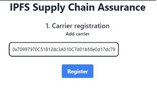
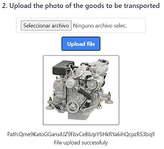
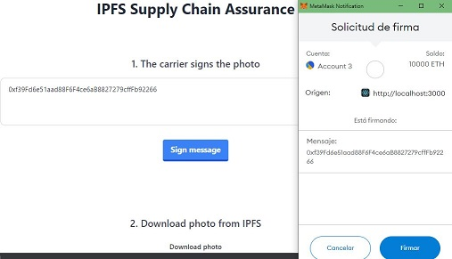
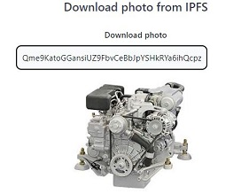
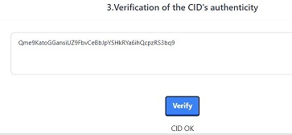
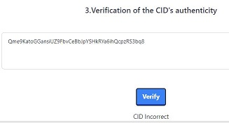

# IPFS Supply Chain Assurance

IPFS based protocol for assurance the supply chain process.

This project allows sharing photos of good's deliveries in a safe mode. When the supplier delivers the goods to the carrier, they take a photo of it in order to show that it corresponds to what was requested by the customer. And most importantly, that the goods are in good condition. The photo is uploaded to IPFS. Afterward, the carrier signs the CID, and the hash generated by this proccess is uploaded to the blockchain (with the corresponding CID and carrier's public address). 
The CID of the photo is sent to the customer.
If there were to be any problem with the state of the goods received by the customer, and the photo received corresponds to the defective merchandise, the customer may verify if the CID is the original, entering it into the system, and requesting the carrier to sign said CID. If the obtained hash differs from the one stored in the smart contract, the system will issue the message indicating that the CID is fake.

In order to access to the system, users must identify themselves with their metamask wallet. Depending on their role (supplier, carrier or customer), they access to diferent screens.

1. The supplier (the owner's site) register the carrier in the system.
   
   

2. The supplier registered upload the photo of the goods to be transported,and obtain an ipfs ID.

    

3. The registered carrier log into the system with his metamask wallet. 
   The carrier signs the CID given by the supplier.

    

4. Everyone are able to download the photo from IPFS

    

5. In case of dispute, due to customer disagreement regarding the goods received, it can be verified if
   the photo is the one taken at the time of loading the goods to the transport, or it's false. In order to
   do this verification, the customer may ask the carrier to sign the CID of the photo that is being delivered.
   The Dapp will display a 'CID OK' or 'incorrect CID' as appropiate. 

          


In order to run the system in local mode, the steps are as follow:

1. Clone the project into your computer.

2. Change into the folder of the project, and run:
```bash
npm i
```
3. It is necessary to have metamask installed. If you don't have it yet, you can download the extension for the browser   you are currently using.

4. Start a local node:
```bash
npx hardhat node
``` 

5.  Compile the smart contract:
```bash
npx hardhat compile
``` 

6. Deploy the smart contract:
```bash
npx hardhat run --network localhost scripts/deploy.js
``` 

7. Start a server to run the DAPP in local mode:
```bash
npm start
``` 

8. The first account given by hardhat node corresponding to the supplier. 
   You have to register Account 0, 1 and 2 in your Metamask wallet. Then, you
   can use Account 1 to register the carrier in the Dapp, and Account 2 to the customer.
 


"# IPFS-Supply-Chain-Assurance" 
